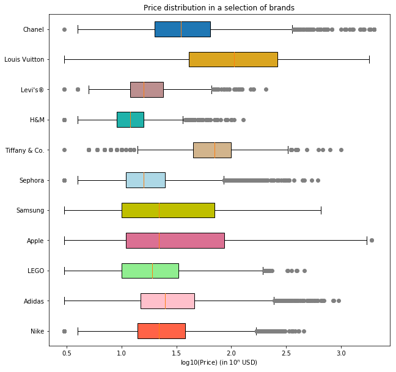
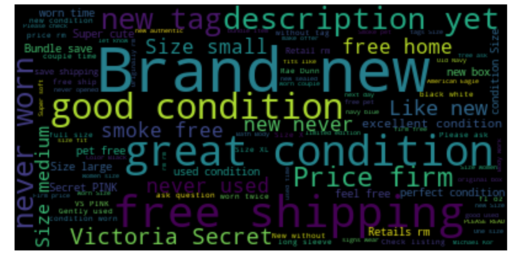
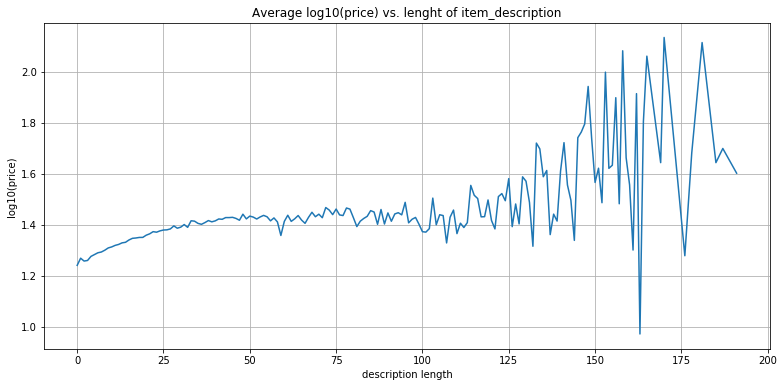
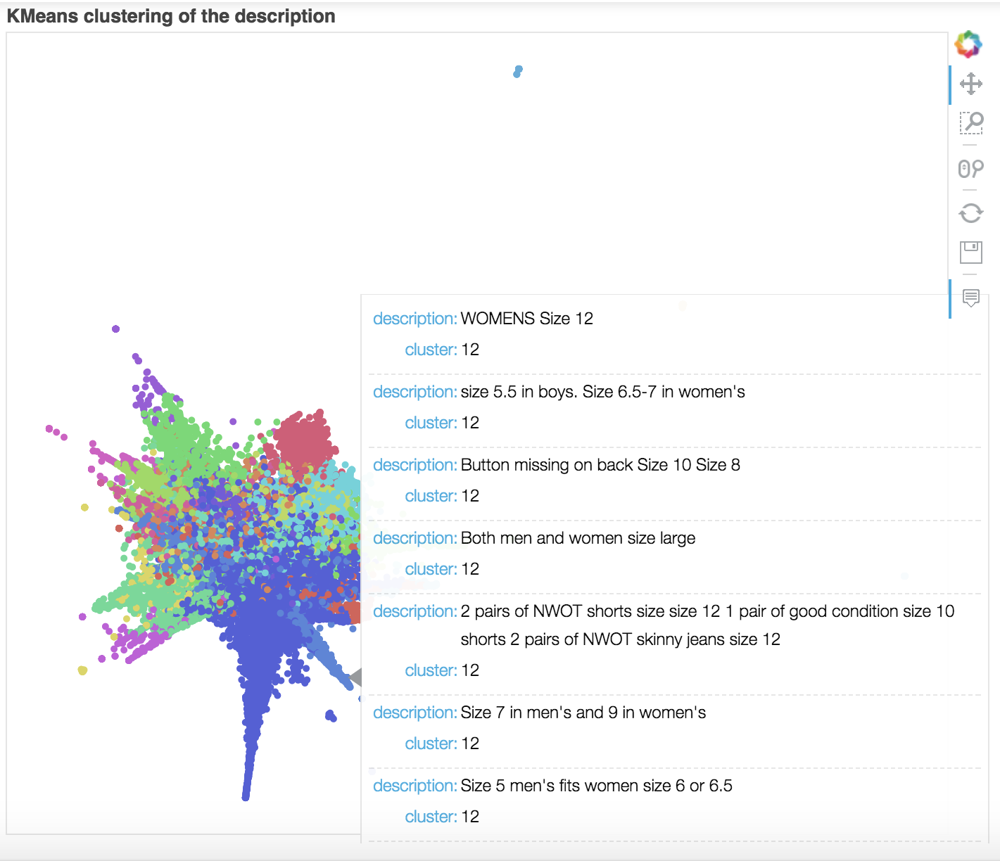

# NLP-Prediction-Python-Project

In this project we analyse thoroughly different variables influencing the prices on Mercari classified marketplace and we build pricing models accordingly. One of our main challenges was to extract relevant insights from the item descriptions (unstructured textual data). We tackled it by adopting classical NLP approaches such as the bag-of-words model (using TFIDF) and downsizing dimensionality of the dataset (thanks to SVD and t-SNE).

We developped several pricing models based on the following algorithms: linear regression, multi-layer perceptron, random forest and k-nearest neighbors.

At the end of the day, a relevant filtering of the dataset coupled with a k-nearest neighbors model proved to give quite good results. 

However we believe that the only relevant metric that should be use is much more qualitative than a L2 error. Do buyers and vendors find those predicted prices relevant regarding the intrinsic value they assign to the items sold?

This project was realised by [Valentin Lapparov](https://github.com/vlapparov) and [Sacha IZADI](https://www.linkedin.com/in/sacha-izadi/).

Here are some of the exploratory visualizations we produced :

  
  

  
  

